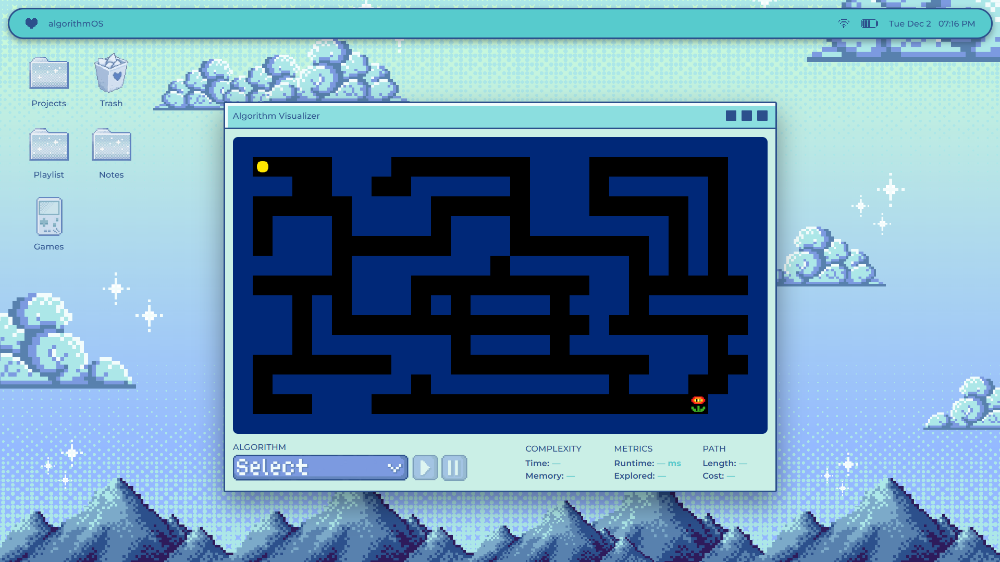
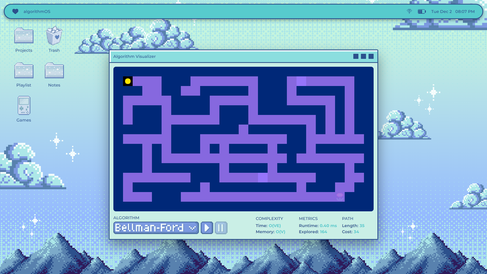
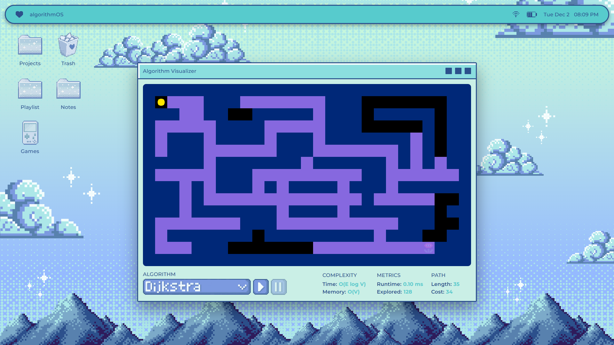

# COSC 428 Final Project: Shortest Path 

This project compares two algorithms with very different time complexities to solve the **shortest path problem** using a weighted maze grid.

---

## 📚 Course Information
- **Course:** COSC 428-001
- **Instructor:** Dr. Avijoy Chakma
- **Due Date:** December 4, 2025

---

## 🧑‍🧑‍🧒 Group Members
- Chenilyn Joy Espineda
- Dayana Ferrufino

---

## 📘 Overview

### Problem Statement:
Given a weighted graph and two vertices **S** (start) and **G** (goal), the objective is to compute the path with the lowest total cost. We represent the graph as a maze grid, where each walkable box becomes a vertex and each movement creates an edge. Tiles have different traversal costs:
* `.` → weight 1
* `~` → weight 5
* `#` → wall (not walkable)

The maze is converted into a graph where edges exist between up, down, left, and right neigbors. 

We compare two approaches with very different time complexities:
1. Bellman-Ford
2. Dijkstra

___

## 🧩 Algorithms

### Algorithm 1: Bellman-Ford
Bellmand-Ford relaxes all edges repeatedly to compute the shortest distance from the start vertex to every other vertex. In our maze, each walkable tile is converted into an ID so distances and parent pointers can be stored. The algorithm performs up to V-1 full relaxation rounds, exploring the entire maze.
<br><br>**Time Complexity:** O(VE)
<br>**Space Complexity:** O(V)


### Algorithm 2: Dijkstra
Dijkstra's algorithm always explores the neighbor with the smallest total cost using a priority queue. Instead of relaxing all edges repeatedly, it processes each vertex only once and always chooses the cheapest available path. This makes it significantly faster in mazes where the weights are positive. 
<br><br>**Time Complexity:** O(E log V)
<br>**Space Complexity:** O(V)

---

## ⚙️ How to Run

Clone the repository

```
git clone https://github.com/chlyn/COSC428_Final_Project.git
```
Open the project folder

```
cd COSC428_Final_Project
```
Run the project by opening `index.html` in any browser



Choose an algorithm (Bellman-Ford or Dijkstra) from the dropdown


Click `Run` to start the algorithm


___

## 🎥 Demo


[Watch the full demo video here](https://drive.google.com/file/d/17xRgLvOYWWfaI0WBg4kqQ--rEe13OPvO/view?usp=sharing)

___

## 📊 Results

### Algorithm 1: Bellman-Ford
Bellman-Ford found the correct shortest path but explored many unnecessary tiles because it repeatedly checks every edge. This causes it to explore the entire maze, resulting in a slower runtime and a large number of explored nodes.

<br>

### Algorithm 2: Dijkstra
Dijkstra found the same shortest path but explored far fewer tiles because it expands nodes based on the lowest current cost, it avoided unnecessary areas of the maze and reached the goal much faster. 

<br>

___

## 🧐 Key Insights
- Both algorithms find the correct path in positiive-weighted graphs.
- Bellman-Ford is simpler but much slower.
- Dijkstra explores fewer vertices tiles and reaches the goal faster and efficiently.
- Bellman-Ford is useful wen negative edge weights exists in the graph but in any other case, Dijkstra is better.
